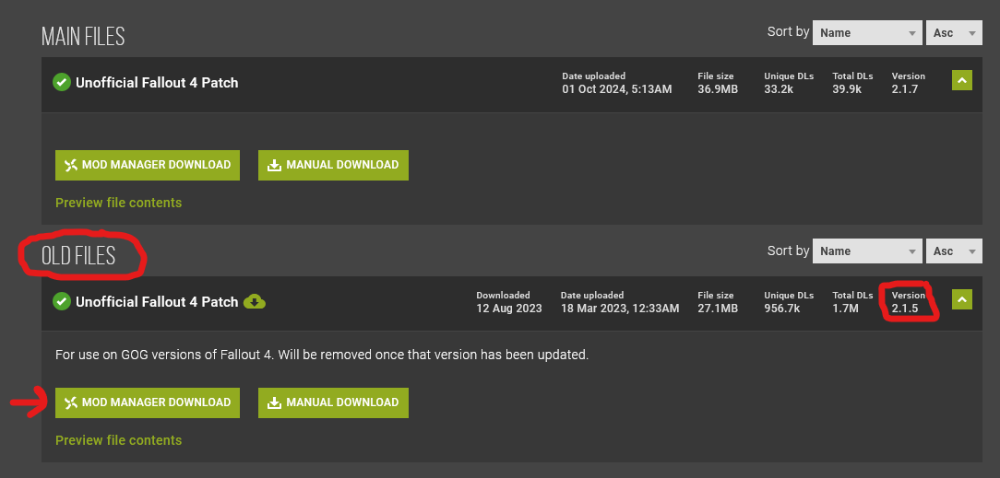

#### Make sure the **FROST** MO2 profile is active before proceeding!

## Creating a Separator in MO2
1. Right-click anywhere in the left pane of MO2 and select **Create Separator**{: .hili}
2. Name the separator **Bug Fixes**{: .hili}

## [Unofficial Fallout 4 Patch (UFO4P)](https://www.nexusmods.com/fallout4/mods/4598?tab=files&file_id=270951&nmm=1)

#### Description
* Fixes thousands of bugs with both the base game and DLCs

#### Installation Instructions
  * **Old Files - Unofficial Fallout 4 Patch** **2.1.5**{: .hili} (Click the blue title above for a direct link to the correct version).
  * Make sure to download the right version of this mod, as shown in the picture

## [Sprint Stutter Fix](https://www.nexusmods.com/Core/Libs/Common/Widgets/DownloadPopUp?id=196371&nmm=1&game_id=1151)

#### Description
* Stops the camera from stuttering while sprinting on uneven surfaces

#### Installation Instructions
* **Main File - Sprint Stuttering Fix** **1.2**{: .hili} (Click the blue title above for a direct link to the correct version).

## [Weapon Debris Crash Fix](https://www.nexusmods.com/Core/Libs/Common/Widgets/DownloadPopUp?id=194684&nmm=1&game_id=1151)

**NOTE:**{: .hili} This fix is needed only by users of Nvidia GPUs newer than Pascal (10 series).
{: .info}

#### Description
* Fixes crashes with the weapon debris setting enabled, specifically on NVIDIA cards

#### Installation Instructions
  * **Main Files - Weapon Debris Crash Fix** **1.2**{: .hili} (Click the blue title above for a direct link to the correct version).

## [Bullet Counted Reload System](https://www.nexusmods.com/fallout4/mods/41178)

#### Description
* Fixes the infamous reload bug with lever action weapons

#### Installation Instructions
* **Main File - Bullet Counted Reload**  **- v2.00**{: .hili}
* **Optional File - BCR- Lever Action Rifle** **v1.02**{: .hili}

## [Crafting Highlight Fix](https://www.nexusmods.com/fallout4/mods/27479?tab=files&file_id=172411&nmm=1) (*O)

#### Description
*  Replaces the full opacity item highlight during crafting with a much more clear outline

#### Installation Instructions
* **Old Files - Crafting Highlight Fix** **1.8.8**{: .hili}

