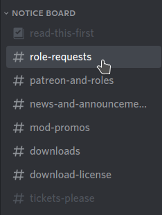
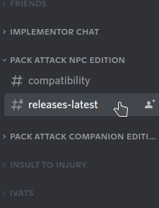

#### Important mods for fixing certain problems and allowing for better configuration of the game

## Creating a Separator in MO2
1. Right-click anywhere in the left pane of MO2 and select **Create Separator**{: .hili}
2. Name the separator **Important Mods**{: .hili}

## [Better Console](https://www.nexusmods.com/Core/Libs/Common/Widgets/DownloadPopUp?id=120757&nmm=1&game_id=1151)

#### Description
* Improves the in-game console, which helps debugging and using console commands.

#### Installation Instructions
* **Main Files - Better Console  1.4.0** (Click the blue title above for a direct link to the correct version)

## [Unlimited Survival Mode](https://www.nexusmods.com/Core/Libs/Common/Widgets/DownloadPopUp?id=114124&nmm=1&game_id=1151)

#### Description
* Restores the game features disabled in Survival mode, such as fast travel and saving. 

#### Installation Instructions
* **Old Files - Unlimited Survival Mode - F4SE 1.4.0** (Click the blue title above for a direct link to the correct version).

## [Mod Configuration Menu (MCM) (*O)](https://www.nexusmods.com/fallout4/mods/21497)

#### Description
* Adds an easy way to configure mods through the in-game pause menu

#### Installation Instructions
* **Main File - Mod Configuration Menu 1.39**

## [Game Configuration Menu (GCM) (*O)](https://www.nexusmods.com/fallout4/mods/33759)

#### Description
* Allows you easily set many game settings without the need of additional ESPs or console commands. 

#### Installation Instructions
* **Main File - Game Configuration Menu**
* **Main File - GCM DLC Automatron ( ESL File )**
* **Main File - GCM DLC Far Harbor**

## [Survival Configuration Menu (SCM) (*F)](https://www.nexusmods.com/fallout4/mods/37599)

#### Description
* Allows you easily change many survival difficulty features without the need of additional ESPs or console commands
* **The FROST patch for this mod is included in the Frost Official Updates mod as an optional install.**
  * The guide will tell you later on when to install the mod and the patch

#### Installation Instructions
* **Main Files - Survival Configuration Menu**

## [Classic Holstered Weapons System (CHW)](https://www.nexusmods.com/fallout4/mods/46101) (*O, *F)

#### Description
* For showing holstered weapons on characters, with various customization options.

#### Installation Instructions
* **Main Files - Classic Holstered Weapons - v1.06b**

## [Remove Ammo from Dropped Guns](https://www.nexusmods.com/fallout4/mods/64426) (*O)

#### Description
- Removes ammo from guns on corpses and adds it to the corpse's inventory.

#### Installation Instructions
- **Main Files - AmmoRemover v1.0.5**

## [Campsite](https://www.nexusmods.com/fallout4/mods/11734) (*O, *F)
#### Description
* Adds portable sleeping bags and other camping items. Highly recommended to be used.
* **The FROST patch for this mod is included in the Frost Official Updates mod as an optional install.**
* With the FROST Campsite patch, you will also have access to a QoL menu that let's you drop campsite items easily, among a few other cool features.

#### Installation Instructions
* **Main Files - Campsite - Simple**

## [Pack Attack NPC (PANPC)](https://discord.gg/jMUnXDV) (*O, *D, *F)

#### Description
* Overhauls the AI completely. NPCs act smarter, use strategies, behave more realistic and use individual AI based on gameplay situations and their factions. It is the best AI mod for Fallout 4 and is developed by Greslin, a programmer who has several decades of programming and gaming knowledge.
* Why isn't this mod hosted on Nexus? You can ask Greslin himself on his Discord Server if you want. 

#### Installation Instructions
**Join the Discord Server:**
* Join the [Greslin Games Discord Server](https://discord.gg/jMUnXDV)
* Read the **#read-this-first** channel of the server
* Go to the **#role-request** channel and ask for the Citizen Role
  * It might take a while until you get that role (up to 8 hours)
  * You can go on with the guide and come back later to this section to finish this
* With the Citizen Role, you get access to the **#releases-latest** channel in the **PACK ATTACK NPC Edition section**

**Download and install the file:**
* In the **#releases-latest** channel, you can find the newest version of PANPC

* Download PANPC, and save it somewhere on your computer (like the 'Downloads'{: .path} folder on your computer)
* Once the download has finished, click the  button at the top of MO2
* From the new window, navigate to where the PANPC was downloaded to and double-click it
* Finish the install normally

**If you need help with this guide or have questions regarding FROST in any way, please do not ask them over at Greslin's Discord Server, but rather on the [Frost Discord Server](https://discord.com/invite/BaKsm7Fn4A)!!!**
{:.error}
