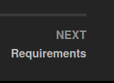

## READ THIS !!!
This guide will currently NOT work with the Fallout 4 update released on 24th April 2024.
I will update the guide and remove this warning as soon as possible, but it might take some time.
It also depends on how fast other mod authors will update their mods.

## Overview
Welcome to **{{ site.title }}**{: .hili}, a fully modular Fallout 4 FROST modding guide!
The goal of this website if to teach you how to make a proper load order for FROST.
You can pick one of two guides, one shows you how to make a proper Fallout 4 setup and Frost setup, the other one just shows you the mods that you absolutely need to play FROST. Everything that is mentioned in this guide is free to install and doesn't cost anything (with the obvious exception of Fallout 4).

## Read this!
* I recommend taking a few minutes to read through the guide completely first before following it
* Everything in this guide is written down for a reason. **Read everything carefully**{: .hili}
* You can **NOT** skip any paragraphs/instructions and expect your game to function as it should.
* Most things are in a **chronological order**{: .hili}.
* Don't switch randomly around between different sections when following this guide.
* The guides assume that you have basic knowledge about using a computer and some very rudimentary modding experience
* Help is always available at the [FROST Discord Server](https://discord.com/invite/BaKsm7Fn4A)
* Even if you are an experienced mod user already, it is still recommended that you read everything carefully.
* The guide will tell you when you are finished, especially the load order section is VERY important!

## About the Guide(s)
I have two guides for you, the **Recommended Guide**{: .hili} and the **Basic Guide**{: .hili}. 
**Choose one!**
Both guides are made with customisation in mind, which means that after you finished installing everything, the load order sections of the guide tell you where you can put additional mods into your load order. Additional mod recommendations will also be given, together with some information about which mods are compatible with FROST and which are not.

### 1. Recommended Guide
The Recommended Guide will carefully walk you through how to: 
* install Fallout 4 and set it up for modding it,
* install Mod Organizer 2 (MO2) as a mod manager,
  * Why not Vortex? An answer can be found [here](./faq.html#why-are-there-only-instructions-for-mo2-but-not-vortex),
* sort your load order and where you can put additional mods into your load order,
* install all necessary bug fixes and stability that are absoolutely needed in EVERY Fallout 4 mod setup,
* install all needed FROST mods,
* install some additional FROST mods,
* install some cool additional mods.

This guide is recommended for people who 
* want to make a modern Fallout 4 setup which is centered around FROST,
* who need a little bit of handholding,
* **who don't have much modding experience**{: .hili}.

Although this guide will carefully show and explain a lot of things, it is recommended that you have at least a tiny amount of modding experience. I will link helpful guides and videos whenever I can to help people that are completely new to modding.

### 2. Basic Guide
This guide shows you the most **basic and bare-bones setup**{: .hili} that you must have for playing FROST. It doesn't get any smaller then that.
It only focuses on the must-use/must-have mods for FROST. It also tells you how to sort your load order and where to put additional mods. **It doesn't tell you how to use a mod manager, and how to set up the game and the mod manager up properly.**{: .hili}

This guide is recommended for people who 
* just want to try out FROST,
* are too lazy to make a more advanced mod setup,
* **and** for people who are experienced enough in modding Bethesda games and just need information about what you absolutely need to play FROST

### Alternative: Unofficial Below Zero Wabbajack**{: .hili}

A wabbajack is an automated modlist installer, so it's your go-to solution if you don't want to manually install FROST by following this guide.
Here is a link to the [Unofficial Below Zero Wabbajack](https://github.com/St1ck2k/FROST---Below-Zero-Fallout-4-Wabbajack-Modlist/tree/main)
The Wabbajack might be outdated or not updated as often, it is unofficial, use it at your own risk!

### About the mods
* Optional mods are flagged with **\*O**{: .hili} in their title.
* All Discord mods mentioned in the guide are entirely optional
* Mods that can only be found on a Discord Server are flagged with **\*D**{: .hili} in their title.
* Mods that need a patch for frost are marked with **\*F**{: .hili} in their title
* The end of the guide will give you an example load order and instructions for where you should put mods that are not mentioned in the guide.

## About MO2
If you need some information and help on how to use MO2, here are some helpful links:
* [GamerPoets' Videos: How to Use MO2](https://www.youtube.com/playlist?list=PLlN8weLk86Xh3ue76x2ibqtmMramwQmHB)
  * A small video series to learn how to do things in MO2
* [MO2 Sorting Crashcourse](https://github.com/sower-j/modding-guides/blob/main/mo2-sorting-crashcourse.md)
  * **If this is your first time using MO2 or a mod manager in general, read this article!** 
  * It contains information that will help you understand the guide a bit better
* The guide will hold your hand on some MO2 things, and also tells you how to properly install it and how to set it up
* It won't tell you everything about MO2, because that would make the guide too long in general

## How to navigate the guide
At the end of each section, you will find a link to the next section. 
Don't skip sections by clicking randomly on the section overview on the left side of this website.
The links to the next section look like this:

Well, we are are ready now. Click on **Requirements**{: .hili} below the Credits to get to the next part of the guide!

## Credits
- [The Midnight Ride Guide](https://themidnightride.moddinglinked.com/index.html) which heavily inspired this guide. A lot of sections from my guide are identical to the Midnight Ride Guide. If you are planning to make a non-FROST Fallout 4 setup, you should use The Midnight Ride.
- [u/Kanonking](https://www.reddit.com/user/Kanonking) for making the first proper FROST guide back in 2019 which inspired me and others to make our own guides
- [Argon](https://www.nexusmods.com/fallout4/users/37574150?tab=user+files) for putting together a FROST Guide which was more comprehensible then previous guides
- [krrptd](https://www.nexusmods.com/fallout4/users/35409570) for providing his load order which inspired other FROST guides, and for making the FROST Cell Fixes
- [BSJ Prophet](https://www.nexusmods.com/fallout4/users/103241948) for making Frost Plus and for always helping me out
- [Naugrim04](https://www.nexusmods.com/fallout4/users/6324000) for creating FROST
- [Greslin](https://fallout.wiki/wiki/Mod:Greslin) for managing the FROST PANPC patch
- All of our users over at the FROST Discord