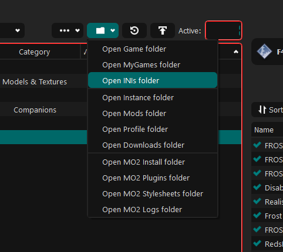

## Automatic Load Order Checker

#### **How it works**{: .hili}:
Copy and paste the content of your loadorder.txt into this text field, and press the button.
Make sure that you copy all of the content of your load order into the text field.

If you use **Vortex**{: .hili}, you can find your loadorder.txt in `C:/Users/[YourUsername]/AppData/Local/Fallout4`{: .path}

If you use **MO2**{: .hili}, you can find your loadorder.txt here:

#### **Put the content of your load order here!**{: .hili}

<textarea id="loadordertxt" name="txtBody" rows="4" cols="50" style="color:black"></textarea>
<input id="clickMe" type="button" value="Press me to check your Load Order!" onclick="checkLoadOrder();" style="color:black" />

