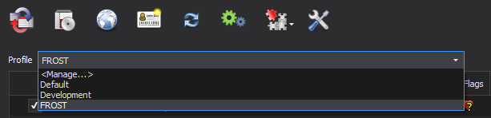

#### In this step, we will install and configure Mod Organizer 2, the best mod manager for any Bethesda game.

## Installing Mod Organizer 2
1. Download the **Mod Organizer 2**{: .hili} file from [here](https://www.nexusmods.com/skyrimspecialedition/mods/6194?tab=files)
2. Once the download has finished, run the installer
3. When prompted to choose an install location, pick any location 
  * **outside** of any default Window folders (like `Program Files x86`{: .path}) **and**
  * **outside** of the game's **Root**{: .hili} folder
4. Click **Next**{: .hili} until the installer finishes

Never use two mod managers for the same game at once. This will mess things up badly.
{:.warning}

## Configuring Mod Organizer 2

### Initial Setup

1. Run **ModOrganizer.exe**{: .hili}
2. You will be prompted with a pop-up called **Creating an instance**{: .hili}, in which you should just select **Next**{: .hili}
3. On the next page, select **Create a portable instance**{: .hili}

  

{:start="4"}
4. On the next page, select **Fallout 4**{: .hili}
5. On the next page, keep the **Location**{: .hili} file path default

If you have MO2 installed on an SSD or a HDD with little space, you can check the **Show advanced options**{: .hili} box and change the **Downloads**{: .hili} file path to a different drive with more space. This will not effect download/game performance, and the downloads can be deleted after the mods have been installed.
{:.info}

{:start="6"}
6. On the last page, select **Finish**{: .hili}
7. MO2 will launch and prompt you with a pop-up called **Show tutorial?**{: .hili}, in which you should select **No**{: .hili}
8. From the pop-up called **Register?**{: .hili}, select **Yes**{: .hili}
  - This pop-up will not show up if you have already registered a different instance of MO2


### Configuring Settings
1. Select the  mo2 settings button at the top of MO2 to open the settings
2. In the **Theme**{: .hili} tab, you can select a different style from the drop-down menu at the top
    - I use the **vs15 Dark theme**{: .hili}
3. In the **Nexus tab**{: .hili}, select **Connect to Nexus**{: .hili}
    * This option will not show up if you have already connected your Nexus account on a different MO2 instance

  


{:start="4"}
4. MO2 will open your browser and prompt you to authorize the connection
5. Once you authorize it, you can close out of your browser and of the MO2 settings
6. Allow MO2 to restart if it asks

## Creating Profiles
Mod Organizer 2's **Profiles feature** allows for easy switching between different mod configurations. This is especially useful because you can easily switch between a FROST Profile and a non-FROST profile if you have the desire to play FROST and normal Fallout 4. In this step, we will create a profile for the guide while keeping a strictly-vanilla profile for testing/de-bugging. Profiles can be selected via the drop-down menu above the left pane. 


1. Select the  mo2 profiles button at the top of MO2 to open the profiles menu
2. Select the **Default profile**{: .hili}, then select **Copy**{: .hili}
3. Name the new profile **FROST**{: .hili}
Select the **FROST**{: .hili} profile and make sure **Use profile-specific Game INI Files**{: .hili} is checked at the bottom

You may get a pop-up called **INI file is read-only**{: .hili} when attempting to make/select a new profile. If so then select **Remember my choice**{: .hili} from the drop-down at the bottom then click **Clear the read-only flag**{: .hili}
{:.info}

{:start="5"}
5. Exit out of the profiles menu and select the **FROST**{: .hili} profile from the drop-down above the left panel




## INI Tweaks + Lose Files
In this step, we will configure the game's INI files to increase performance/stability at minimal visual cost. 

1. Make sure the **FROST**{: .hili} profile is active
2. Click the  at the top of MO2 and select **INI Editor**{: .hili}
3. Select the **Fallout4Prefs.ini**{: .hili} tab
4. Use ctrl+f to find and change the following options
  * Set **fDirShadowDistance** to 7000
  * Set **fShadowDistance** to 7000
  * Set **uiOrthoShadowFilter** to 2
  * Set **iMaxFocusShadowsDialogue** to 3
  * Set **iMaxFocusShadows** to 3
  * Set **fBlendSplitDirShadow** to 96.0000


These settings tweak shadows to drastically improve performance without much visual cost. 
{:.info}

{:start="5"}
5. Save your changes, but stay in the INI editor
6. Select the **Fallout4Custom.ini**{: .hili} tab
7. Paste in the following to **enable lose files**{: .hili}:
```
[Archive]
bInvalidateOlderFiles=1
sResourceDataDirsFinal=
```

These settings allow for files from mods to be loaded in-game. It is intentional that the bottom setting does not have anything after the =
{:.info}

**Note:** You can also add **bEnableWetnessMaterials=0** (or change it if it already exists) in your **Fallout4Prefs.ini** in MO2. This will deactivate the wetness effect from objects when it's raining. This causes snow to not be "wet" anymore. Only do this if you really want it or are bothered that snow sometimes has a slight wetness/reflection effect when it's raining.


## How to MO2 
If you need some information and help on how to use MO2, here are some helpful links:
* [GamerPoets' Videos: How to Use MO2](https://www.youtube.com/playlist?list=PLlN8weLk86Xh3ue76x2ibqtmMramwQmHB)
  * A small video series to learn how to do things in MO2
* [MO2 Sorting Crashcourse](https://github.com/sower-j/modding-guides/blob/main/mo2-sorting-crashcourse.md)
  * If this is your first time using MO2, read this article! It contains information that will help you understand the guide a bit better


## Mod Installation Advice
If you are completely unfamiliar with Mod Organizer 2, I recommended watching [GamerPoet's video](https://www.youtube.com/watch?v=7v0wWVuOagA) about mod installation in MO2. As it was made for Skyrim, it has some information that does not apply to Fallout 4, such as the Steam Workshop part which you can just ignore. However, the rest of the information about downloading/installing mods from Nexus still applies. 
{:.info}

When the guide says to install a mod, it will be formatted as follows: **Main File - Unofficial Fallout 4 Patch 2.1.2b**{: .hili}. This is referring to the mod's category on Nexus, the file name, and the file version. Sometimes I will leave the file version out.


Unless instructed otherwise, simply download the listed file using the **Mod Manager Download**{: .hili} button and install it through MO2. If you do not know how to install mods through MO2, please watch the video linked above. Sometimes, a mod will not have a **Mod Manager Download**{: .hili}, or will be hosted on a site other than Nexus. If that is the case, do the following: 

1. Click the **Manual Download**{: .hili} button (or whatever the download button is for the respective site)
2. Once the download has finished, click the  button at the top of MO2
3. From the new window, navigate to where the file was downloaded to and double-click it
4. Finish the install normally

When downloading multiple files from the same page, you will be prompted with a box in Mod Organizer 2 with the options **Merge**{: .hili}, **Replace**{: .hili}, and **Rename**{: .hili}. You should select the **Rename**{: .hili} option and rename the mod to its respective file name. This will make MO2 install them as separate files for easier management. If you are updating from an old version of a mod, you should select **Replace**{: .hili}. This will delete all the files from the old version of the mod and replace them,with the ones from the new version. This is the only time you should use the **Replace option**{: .hili}, otherwise always use **Rename**{: .hili}. 

