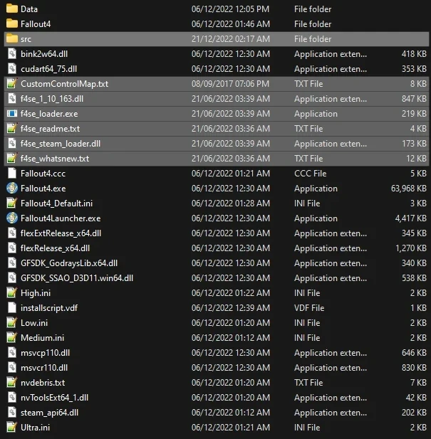
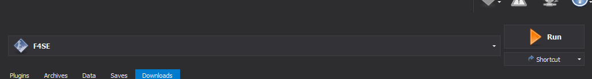

#### Make sure the **FROST** MO2 profile is active before proceeding!
The titles on this guide are also links that you can click on to get to the mods.
{: .info}

## [Fallout 4 Script Extender](https://www.nexusmods.com/fallout4/mods/42147?tab=files&file_id=253313)

#### Description
* Extends the scripting capabilities of the game

#### Installation Instructions

1. **Old Files - Fallout 4 Script Extender (F4SE)** **0.6.23**{: .hili} (Manual download, click the blue title above for a direct link to the correct version).
2. From the downloaded archive, extract everything (all files and folders!) to the game's Root folder.

If you do not know what the Root folder is, read the Key Terminology section from the Initial Setup page.
{: .info}

If you did everything correctly, your **Root Folder**{: .hili} should look similar to this:

In order for the script extender to work, you need to launch the game using the f4se_loader.exe file. It will automatically be added to Mod Organizer 2 upon restarting it. It should look like this:
{: .info}

## [xSE PluginPreloader](https://www.nexusmods.com/fallout4/mods/33946?tab=files&file_id=221778)

#### Description
- Allows F4SE plugins to be loaded before the game initializes
- This mod needs to be installed manually without your mod manager

#### Installation Instructions
1. Download the **Old Files - xSE PluginPreloader** **0.2.5.1**{: .hili} using the **Manual Download**{: .hili} button (Click the blue title above for a direct link to the correct version).
2. From the download archive, extract the two files to the game's **Root**{: .hili} folder

When installing mods, MO2 might ask you about category mapping. Just select "Disable" if it pops up for you.
{:.info}

## [Address Library for F4SE Plugins](https://www.nexusmods.com/fallout4/mods/47327)

#### Description
- Resource required for other F4SE plugins

#### Installation Instructions
* **Main Files - Address Library - All In One**

If you do not know what these instructions mean, or how to install mods with MO2, **read the Mod Installation Advice**{: .hili} section from the MO2 page again!
{: .info}

After installing with a mod with MO2, make sure you check the box next to it in the left pane of MO2 to enable it
{: .info}

## [Backported Archive2 Support System](https://www.nexusmods.com/fallout4/mods/81859)

#### Description
- Allows the downgraded executable to use the updated BA2 files.

#### Installation Instructions

* **Main Files - BackportedBA2Support-1_0**

## [Simple Fallout 4 Downgrader](https://www.nexusmods.com/fallout4/mods/81933)

#### Description
- Reverts game code to **version 1.10.163**{: .hili} for wider modding support.

#### Installation instructions:

- **Main Files - Simple Fallout 4 Downgrader**
  - From the downloaded archive, extract everything to the game's Root folder.
  - Double-click the downgrader executable to launch it.
  - Wait for the "Patching successful" message in the console window that just opened, then you can close it.

## Remove Creation  (CC) Content
#### Description
* This step removes CC content that has not been patched for FROST and will cause issues
* These CC files have been added by the Next-Gen update, and while they work on the downgraded version of Fallout 4, they are not yet patched for FROST and should be removed

#### Uninstallation
* Open the  **Data**{: .hili} folder (`Steam\steamapps\common\Fallout 4\Data`{: .path}) in the Windows Explorer
* Delete the following files from it:
  * `ccBGSFO4044-HellfirePowerArmor.esl`
  * `ccBGSFO4115-X02.esl`
  * `ccBGSFO4116-HeavyFlamer.esl`
  * `ccBGSFO4110-WS_Enclave.esl`
  * `ccBGSFO4096-AS_Enclave.esl`
  * `ccFSVFO4007-Halloween.esl`
  * `ccBGSFO4046-TesCan.esl`
  * `ccSBJFO4003-Grenade.esl`
  * `ccOTMFO4001-Remnants.esl`

## [Buffout 4](https://www.nexusmods.com/fallout4/mods/47359?tab=files)

#### Description
- Fixes numerous engine bugs and scripts, and also provides helpful crash logs when you game crashes.

#### Installation Instructions
* Download and install the **Main File - Buffout**{: .hili} normally through MO2
* Once the mod has been installed, double-click on it in the left pane of MO2
* In the Text Files tab, select `F4SE/Plugins/Buffout4/config.toml`
* Change the following options:
  * Set INISettingCollection to false (line 22)
  * Set MaxStdIO to 2048 (line 24)
*  **IMPORTANT**: The value needs to be 2048, not -2048! When done, the setting will look like this: `MaxStdIO = 2048`.

  * If you encounter problems with Buffout 4, check out this [article](https://www.nexusmods.com/fallout4/articles/3115)

Without the [Microsoft VC++ 2015-2022](https://docs.microsoft.com/en-us/cpp/windows/latest-supported-vc-redist?view=msvc-170) (x86 and x64 versions) which was mentioned in the requirements section of the guide, Buffout 4 and the xSE Preloader will not work properly. Make sure that you've installed it!
{: .info}

## [High FPS Physics Fix](https://www.nexusmods.com/fallout4/mods/44798?tab=files&file_id=242328&nmm=1)

#### Description
- Allows for playing at framerates over 60, mitigates stutter, and reduces load times

#### Installation Instructions
1. Download and install the **Main File - High FPS Physics Fix** **0.8.6**{: .hili} (Click the blue title above for a direct link to the correct version)
2. Once the mod has been installed, double-click on it in the left pane of MO2
3. In the **INI-Files**{: .hili} tab, select `F4SE/Plugins/HighFPSPhysicsFix.ini`{: .path}
4. Change the following options:
    - Set **DisableBlackLoadingScreens=**{: .hili} to **true**{: .hili} (line 37)
    - Set **DisableAnimationOnLoadingScreens=**{: .hili} to **true**{: .hili} (line 44)

**REMINDER**{: .hili}: You need to run the game through the F4SE option in Mod Organizer 2 from now on, NOT the Fallout 4 option. You may need to restart MO2 for the option to appear. If that is not the case, you can manually add or select it in MO2. 
{: .info}

